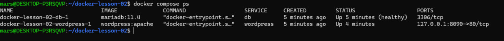
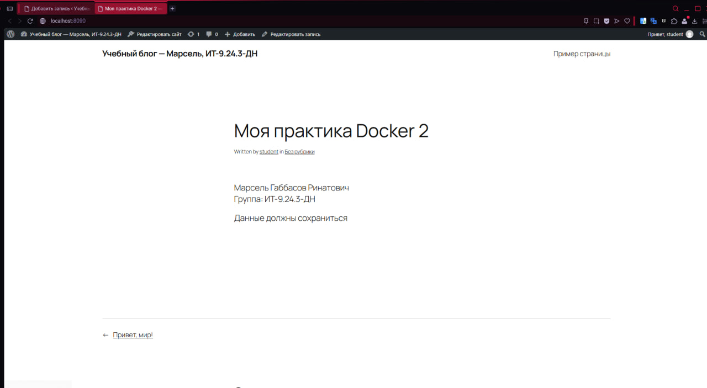
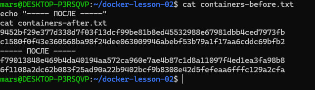
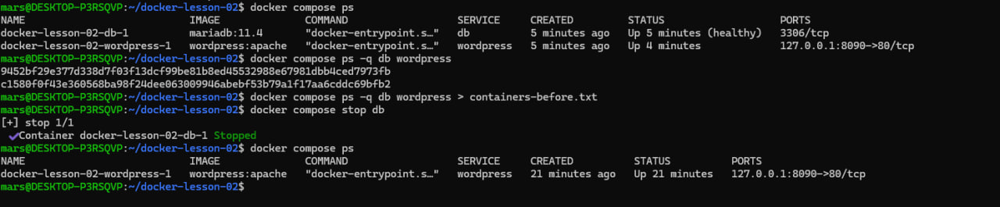
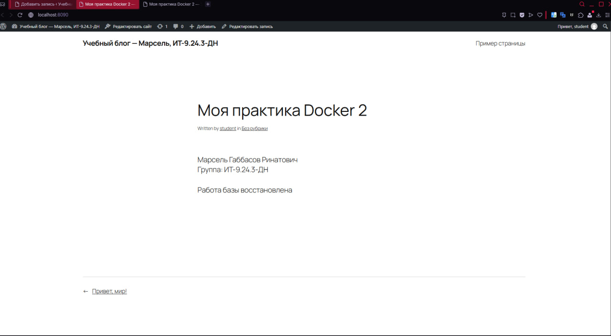

# Практика 2. Docker Compose

**Автор:** Марсель Габбасов Ринатович
**Группа:** ИТ-9.24.3-ДН

## Цель работы

Научиться запускать несколько контейнеров с помощью Docker Compose, настроить WordPress и MariaDB, а также проверить сохранение данных после остановки и пересоздания контейнеров.

## 1. Подготовка

Для выполнения работы использовались:

* Windows;
* WSL2 Ubuntu;
* Docker Desktop;
* Docker Engine;
* Docker Compose.

Работа выполнялась в отдельной папке:

```text
~/docker-lesson-02
```

Проверил версии Docker и Docker Compose:

```bash
docker version
docker compose version
```

## 2. Создание Docker Compose

Для запуска WordPress и MariaDB был создан файл `compose.yaml`.

В проекте используются два сервиса:

* `db` — база данных MariaDB;
* `wordpress` - сайт WordPress.

Для хранения данных используются два Docker volume:

* `db_data` - данные MariaDB;
* `wp_data` - данные WordPress.

WordPress доступен локально по адресу:

```text
http://localhost:8090
```

После создания файла была выполнена проверка конфигурации:

```bash
docker compose config -q
```

Ошибок конфигурации не обнаружено.

## 3. Запуск контейнеров

Контейнеры были запущены командой:

```bash
docker compose up -d
```

После запуска проверил состояние сервисов:

```bash
docker compose ps
```

MariaDB перешла в состояние `healthy`, а WordPress запустился и стал доступен на порту `8090`.



## 4. Установка WordPress

После запуска контейнеров был открыт WordPress:

```text
http://localhost:8090
```

При установке были указаны:

* пользователь: `student`;
* электронная почта: `student@example.com`;
* название сайта: `Учебный блог — Марсель, ИТ-9.24.3-ДН`.

После установки была создана запись:

**Моя практика Docker 2**

В записи указаны:

* Марсель Габбасов Ринатович;
* группа ИТ-9.24.3-ДН;
* фраза «Данные должны сохраниться».

Адрес опубликованной записи:

```text
http://localhost:8090/?p=5
```



## 5. Проверка сохранения данных

Для проверки были сохранены ID контейнеров до пересоздания:

```bash
docker compose ps -q db wordpress > containers-before.txt
```

После этого контейнеры были остановлены и удалены:

```bash
docker compose down
```

При этом команда `down -v` не использовалась, поэтому Docker volumes с данными остались.

Контейнеры были запущены снова:

```bash
docker compose up -d
```

После запуска были получены новые ID:

```bash
docker compose ps -q db wordpress > containers-after.txt
```

Старые и новые ID отличаются, значит контейнеры были созданы заново.



## 6. Проверка остановки базы данных

Дополнительно была выполнена проверка поведения WordPress при остановленной базе данных.

Команда:

```bash
docker compose stop db
```

После остановки базы данных WordPress-контейнер продолжил работать.



После проверки база данных была снова запущена:

```bash
docker compose start db
```

## 7. Проверка восстановления данных

После повторного запуска базы данных опубликованная ранее запись WordPress снова открылась.

В запись была добавлена фраза:

**Работа базы восстановлена**

После сохранения изменения были видны на опубликованной странице.



## 8. Результат

В ходе работы было проверено:

* запуск нескольких контейнеров через Docker Compose;
* взаимодействие WordPress и MariaDB;
* использование Docker volumes;
* остановка контейнера базы данных;
* пересоздание контейнеров;
* сохранение данных после удаления контейнеров;
* восстановление работы сайта после запуска базы данных.

Главный результат работы - **данные WordPress не были потеряны после пересоздания контейнеров**, потому что данные хранятся в Docker volumes.

## 9. Файлы проекта

В папке практической работы находятся:

* `compose.yaml` — конфигурация Docker Compose;
* `containers-before.txt` — ID контейнеров до пересоздания;
* `containers-after.txt` — ID контейнеров после пересоздания;
* `result.txt` — результаты выполненных проверок;
* `screenshots/` — скриншоты выполнения работы.

