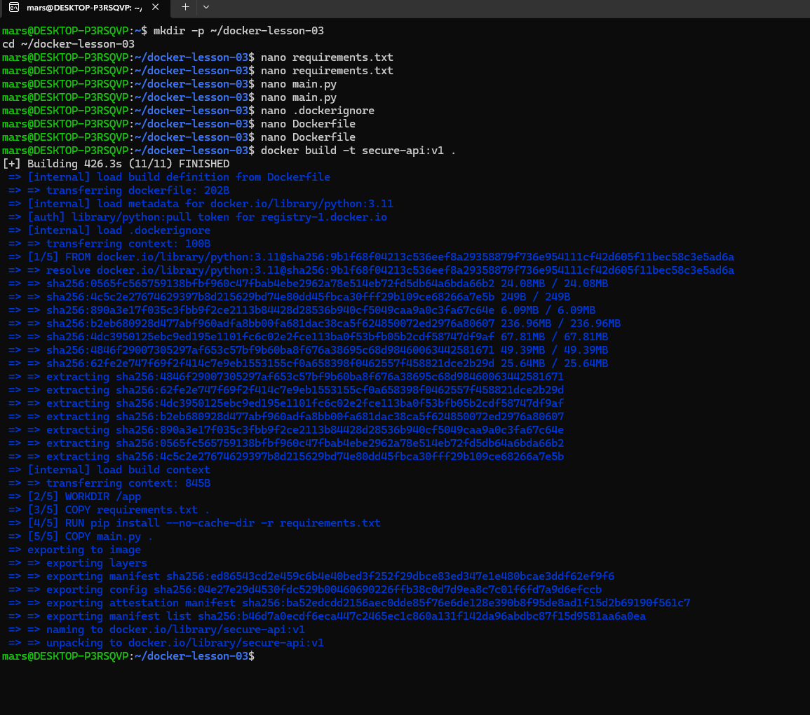
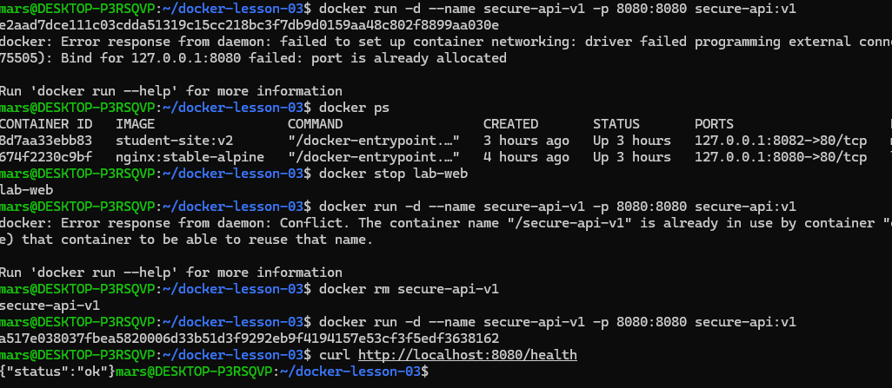
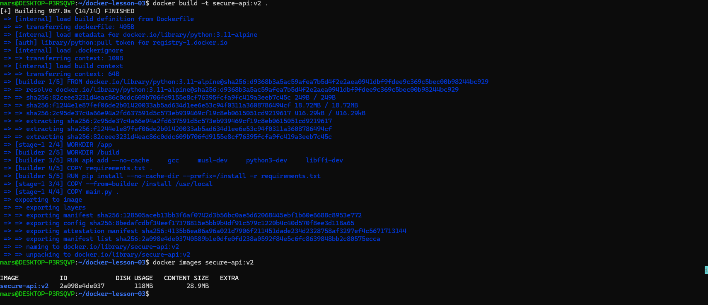
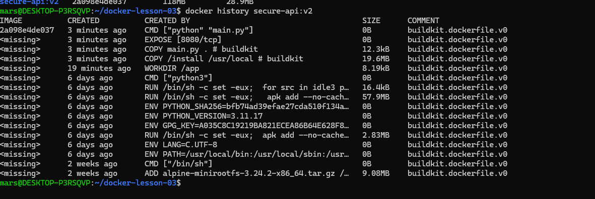
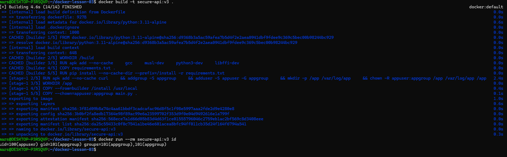
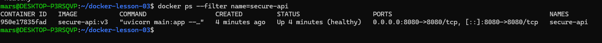
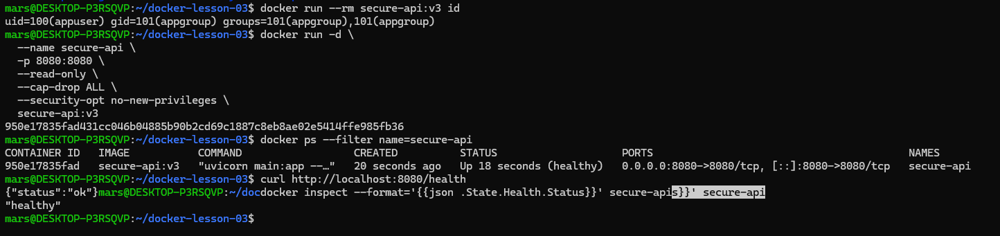

# Практика 3. Production-Ready Docker

**Автор:** Марсель Габбасов Ринатович
**Группа:** ИТ-9.24.3-ДН

## Цель работы

Подготовить Docker-образ FastAPI-приложения к более безопасному запуску. Для этого необходимо уменьшить размер образа, настроить многоэтапную сборку, запуск от непривилегированного пользователя, проверку состояния контейнера и запись логов.

## 1. Создание Docker-образа

Сначала был собран образ приложения на основе Python 3.11. Зависимости устанавливаются отдельно от исходного кода, что позволяет эффективнее использовать кэш Docker.

Для исключения ненужных файлов из контекста сборки был создан `.dockerignore`. В нём указаны кэш Python, виртуальное окружение, файлы Git и другие ненужные для сборки данные.



После запуска контейнера была проверена работа endpoint `/health`. Приложение вернуло ответ со статусом `ok`.



## 2. Уменьшение размера образа

Для уменьшения размера была реализована многоэтапная сборка Docker.

На первом этапе устанавливаются инструменты для сборки зависимостей, включая `gcc`, `musl-dev`, `python3-dev` и `libffi-dev`.

На втором этапе используется отдельный образ `python:3.11-alpine`. В него копируются установленные зависимости и исходный код приложения. Инструменты компиляции из первого этапа не переносятся в итоговый образ.

В результате размер образа `secure-api:v2` составил 118 МБ.



История слоёв была проверена командой `docker history`. В итоговом образе отсутствует отдельный слой установки компилятора из этапа сборки.



## 3. Запуск от непривилегированного пользователя

В Dockerfile были созданы пользователь `appuser` и группа `appgroup`. Для запуска приложения используется инструкция `USER appuser`.

Проверка командой `docker run --rm secure-api:v3 id` подтвердила, что контейнер запускается от пользователя `appuser`, а не от `root`.



## 4. Ограничение прав контейнера

Для проверки безопасности контейнер был запущен с параметрами:

```bash
docker run -d \
  --name secure-api \
  -p 8080:8080 \
  --read-only \
  --cap-drop ALL \
  --security-opt no-new-privileges \
  secure-api:v3
```

Параметр `--read-only` делает основную файловую систему контейнера доступной только для чтения. `--cap-drop ALL` отключает дополнительные Linux capabilities, а `no-new-privileges` запрещает процессам получать дополнительные привилегии.

Контейнер успешно запустился и продолжил работать с заданными ограничениями.



## 5. Проверка состояния приложения

В Dockerfile настроен `HEALTHCHECK`, который проверяет endpoint `/health` каждые 30 секунд.

Для проверки использовались команды:

```bash
curl http://localhost:8080/health
```

```bash
docker inspect --format='{{json .State.Health.Status}}' secure-api
```

Первый запрос вернул `{"status":"ok"}`, а проверка состояния контейнера показала `healthy`.



## 6. Генерация хеша и запись логов

Для хеширования паролей используется библиотека `bcrypt`. Работа endpoint `/hash` была проверена запросом:

```bash
curl "http://localhost:8080/hash?password=test123"
```

Приложение вернуло JSON с хешем пароля.

Путь к файлу логов задаётся переменной окружения `LOG_FILE` и указывает на `/var/log/a_
